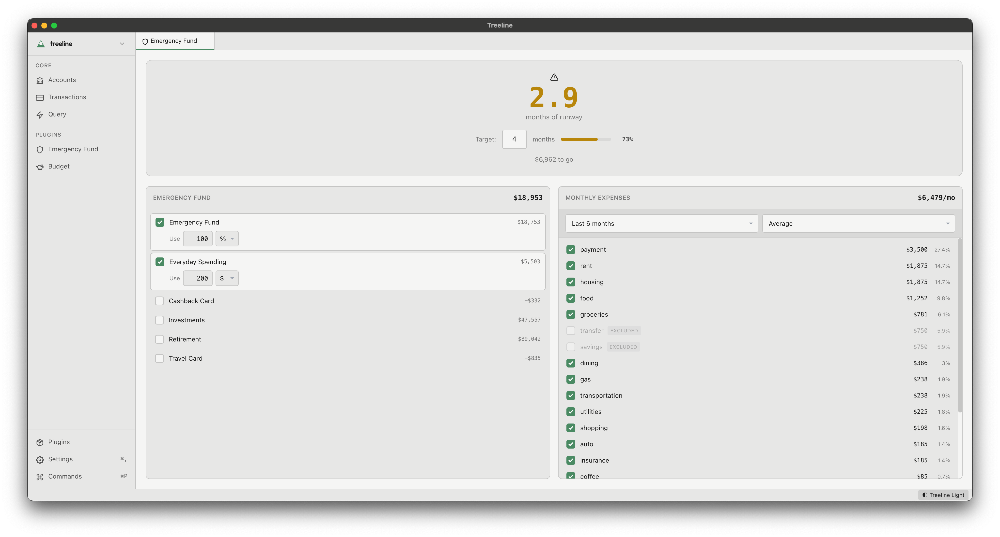
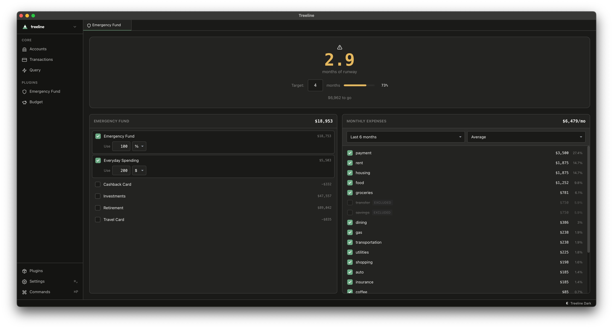

See how long your emergency fund would last based on your actual spending patterns.

## How it works

Instead of guessing whether you have "3-6 months of expenses saved," this plugin calculates it from your real spending history. It looks at what you actually spend, not what you think you spend, and tells you exactly how many months of runway your emergency fund provides.

## What you'll see

- **Months of runway** - How long your fund would last at your current burn rate
- **Fund allocation** - Select which accounts hold your emergency fund, with percentage or fixed amount allocation
- **Expense breakdown** - See which tags drive your monthly spending, with the ability to exclude any from the calculation
- **Configurable calculation** - Mean, median, or trimmed mean for expense averaging over 3, 6, or 12 months

## Getting started

Open the plugin and it works immediately—no setup required. Check the accounts that hold your emergency fund, set your target months, and the calculator updates live. Exclude expense tags that shouldn't count (like one-time purchases or transfers) directly from the breakdown list.
